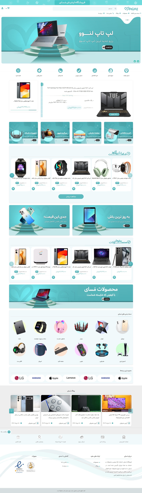

# 🌐 **پروژه فروشگاهی `MasaiShop` با جنگو**



## 📋 توضیحات
این پروژه یک فروشگاه حرفه‌ای و کامل است که با استفاده از فریم‌ورک Django توسعه داده شده است. هدف این پروژه ارائه یک پلتفرم فروشگاه اینترنتی کامل و جذاب برای کاربران است تا کاربران را با تجربه‌ای منحصربه‌فرد از خرید آنلاین روبرو کند.

## 🚀 ویژگی ها

`صفحات اولیه`
- <b>صفحه اصلی: </b>نمایش محصولات محبوب، آخرین محصولات، محصولات تخفیف خورده، محصولات پرفروش، دسته بندی ها، آخرین مقالات، برند های محبوب و بنر های مختلف
- <b>صفحه تماس با ما: </b>امکان ثبت پیام برای مدیر
- <b>صفحه درباره ما: </b>نمایش اطلاعات مربوط به فروشگاه مَسای

`صفحات مربوط به محصولات`
- <b>صفحه محصولات: </b>نمایش تمام محصولات با صفحه بندی اصولی و سیستم فیلتر حرفه‌ای
- <b>صفحه برند محصولات: </b>نمایش محصولات مربوط به برند انتخاب شده با صفحه بندی اصولی و سیستم فیلتر حرفه‌ای
- <b>صفحه دسته بندی محصولات: </b>نمایش محصولات مربوط به دسته بندی انتخاب شده با صفحه بندی اصولی و سیستم فیلتر حرفه‌ای
- <b>صفحه محصولات تخفیف خورده: </b>نمایش محصولات تخفیف خورده با صفحه بندی اصولی و سیستم فیلتر حرفه‌ای
- <b>صفحه جزئیات محصول: </b>نمایش کامل جزئیات محصول با سیستم کامنت و اسلایدر تصاویر محصول و ...
- <b>جستجو محصولات: </b>قابلیت جستجوی محصولات براساس عنوان محصول و نمایش نتیجه سرچ با صفحه بندی اصولی و سیستم فیلتر حرفه‌ای

`صفحات مربوط به خرید`
- <b>صفحه سبد خرید: </b>نمایش محصولات اضافه شده و امکان بروزرسانی و حذف محصولات و اعمال کد تخفیف
- <b>صفحه انتخاب آدرس و روش پرداخت: </b>امکان انتخاب آدرس و روش پرداخت برای محصولات در سبد
- <b>صفحه پایان خرید: </b>نمایش پیام موفقیت پرداخت و کد سفارش

`صفحات مربوط به مقالات`
- <b>صفحه لیست مقالات: </b>نمایش لیست مقالات با صفحه بندی اصولی
- <b>صفحه جزئیات مقاله: </b>نمایش جزئیات مقاله و آخرین مقالات

`صفحات مربوط به ورود و ثبت نام`
- <b>سیستم ورود برای کاربران: </b>امکان ورود کاربران
- <b>سیستم ثبت نام برای کاربران: </b>امکان ثبت نام کاربران

`صفحات پنل کاربری`
- <b>صفحه اصلی: </b>نمایش آمار حساب کاربری، سفارشات اخیر، محصولات محبوب
- <b>صفحه سفارشات: </b>نمایش تمام سفارشات با صفحه بندی اصولی
- <b>صفحه جزئیات سفارش: </b>نمایش جزئیات سفارش
- <b>صفحه سفارشات تحویل داده شده: </b>نمایش تمام سفارشات تحویل داده شده با صفحه بندی اصولی
- <b>صفحه سفارشات در سبد: </b>نمایش تمام سفارشات موجود در سبد با صفحه بندی اصولی و امکان حذف از سبد
- <b>صفحه سفارشات لغو شده: </b>نمایش تمام سفارشات لغو شده با صفحه بندی اصولی
- <b>صفحه لغو سفازش: </b>امکان لغو سفارش تا 48 ساعت پس از ثبت سفارش
- <b>صفحه محصولات مورد علاقه: </b>نمایش محصولات مورد علاقه با صفحه بندی اصولی و امکان حذف از لیست
- <b>صفحه آدرس های من: </b>نمایش آدرس های کاربر با صفحه بندی اصولی و امکان اضافه کردن آدرس جدید و حذف آدرس و تنظیم آدرس به عنوان پیش‌فرض
- <b>صفحه اعلان ها: </b>نمایش اعلان ها و حذف خودکار با زمان تنظیم شده توسط مدیر یا ادمین
- <b>صفحه اعلان ها: </b>نمایش اعلان ها و حذف خودکار با زمان تنظیم شده توسط مدیر یا ادمین
- <b>صفحه پروفایل: </b>نمایش پروفایل
- <b>صفحه ویرایش پروفایل: </b>امکان ویرایش پروفایل
- <b>صفحه تغییر رمز عبور: </b>امکان تغییر رمز عبور

## 🛠️ نصب و راه اندازی
برای نصب و راه‌اندازی این پروژه، مراحل زیر را دنبال کنید:

1. **کلون کردن مخزن:**

```bash
git clone https://github.com/arvinmaroufi/MasaiShop.git
cd repo
```

2. **ایجاد محیط مجازی (اختیاری):**

```bash
python -m venv venv
source venv/bin/activate  # برای سیستم‌های Unix/Mac
venv\Scripts\activate  # برای ویندوز
```

3. **نصب وابستگی‌ها:**
   
```bash
pip install -r requirements.txt
```

4. **اجرای migrations:**

```bash
python manage.py migrate
```

5. **اجرای سرور:**

```bash
python manage.py runserver
```

6. **دسترسی به وب‌سایت:**
   در مرورگر خود به آدرس http://127.0.0.1:8000/ بروید.

## ✅ استفاده

پس از راه‌اندازی، می‌توانید پروژه رو مشاهده کنید و لذت ببرید.

## 🎯 مشارکت

اگر تمایل به مشارکت در این پروژه دارید، لطفاً مراحل زیر را دنبال کنید:

1. یک فورک از مخزن ایجاد کنید.
2. تغییرات خود را اعمال کنید.
3. یک Pull Request ارسال کنید.

## 🧾 مجوز

این پروژه تحت مجوز MIT منتشر شده است.

## 💻 برنامه نویس

**آروین معروفی** - [لینک پروفایل گیت‌هاب](https://github.com/arvinmaroufi)

## 💬 ارتباط با ما

اگر سوالی دارید یا نیاز به کمک بیشتری دارید، لطفاً با ما تماس بگیرید:

- **ایمیل**: [arvinmaroufi.dev@gmail.com](mailto:arvinmaroufi.dev@gmail.com)
- **گیت‌هاب**: [arvinmaroufi](https://github.com/arvinmaroufi/arvinmaroufi/issues)
- **اینستاگرام**: [arvinmaroufi.ir](https://instagram.com/arvinmaroufi.ir)
- **تلگرام**: [arvin_maroufi](https://t.me/arvin_maroufi)

ما خوشحال می‌شویم که از شما بشنویم 🙏

## ❤️ حمایت از ما

اگر از کار ما لذت می‌برید و می‌خواهید از ما حمایت کنید، لطفاً ما را در شبکه‌های اجتماعی دنبال کنید:

- **گیت‌هاب**: [arvinmaroufi](https://github.com/arvinmaroufi)
- **اینستاگرام**: [arvinmaroufi.ir](https://instagram.com/arvinmaroufi.ir)
- **تلگرام**: [arvinmaroufi_ir](https://t.me/arvinmaroufi_ir)

از حمایت شما سپاسگزاریم 🙏